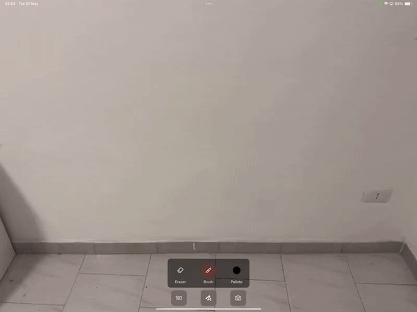

# DelineAR
DelineAR is an app that enhances the drawing experience by providing tools powered with Augmented Reality technologies (AR) and allows users to save their work into their device's photo library.

## Features
- #### Draw and Erase with AR in Real-Time:
  Draw with different pallete color choices directly onto real-world surfaces using your device's camera, creating a seamless blend between physical and digital art; Erase with the same principle.
- #### Integrate Pre-Made Components:
   Easily incorporate pre-made simple shapes into your drawings, complete with interaction properties such as resizing, rotating, and moving.
- #### Take a Picture and Save It in Lbirary:
  Take a picture in camera mode and save images with your AR drawings directly to your device's photo library. 

## Demo

- #### Choose color from pallete
  | Choose Color |
  | ---- |
  |  |

- #### Draw whatever is in your mind
  | Draw |
  | ---- |
  |  |

- #### Erase something you don't like
  | Erase |
  | ---- |
  |  |

- #### Integrate supportive shapes
  | Component Integrations |
  | ---- |
  |  |

- #### Save your work
  | Save Image |
  | ---- |
  |  |

